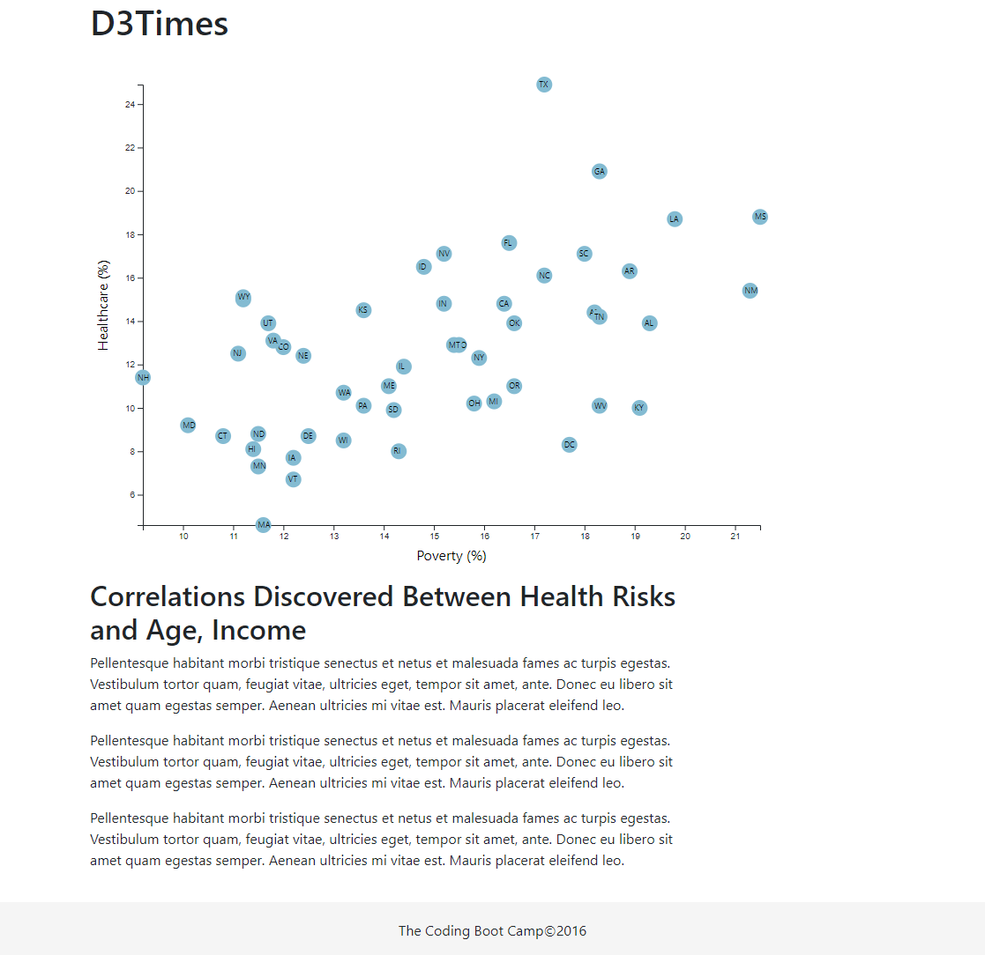
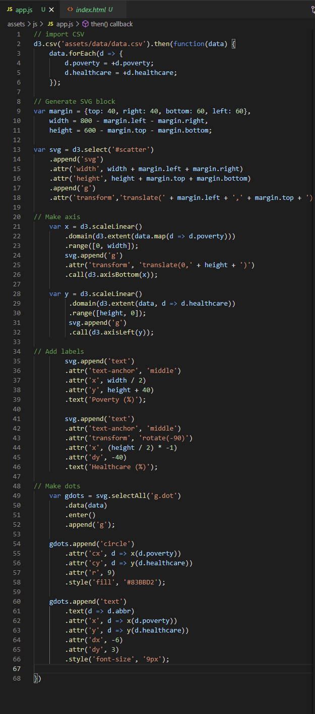

# D3 Homework - Data Journalism and D3

The data set included with the assignment is based on 2014 ACS 1-year estimates

### Before You Begin
1. Create a new repository for this project called `D3-Challenge`.
2. Clone the new repository to your computer.
3. Inside your local git repository, create a directory for the D3 challenge. Use the folder name to correspond to the challenge: **D3_data_journalism**.
4. This homework utilizes both **html** and **Javascript** so be sure to add all the necessary files. These will be the main files to run for analysis.
5. Push the above changes to GitHub or GitLab.

## Your Task
### Core Assignment: D3 Dabbler (Required Assignment)

You need to create a scatter plot between two of the data variables `Healthcare vs. Poverty`.
Using the D3 techniques create a scatter plot that represents each state with circle elements. You'll code this graphic in the `app.js` file of your directory—make sure you pull in the data from `data.csv` by using the `d3.csv` function. Your scatter plot should ultimately appear like the image at the top of this section.
* Include state abbreviations in the circles.
* Create and situate your axes and labels to the left and bottom of the chart.
- - -
